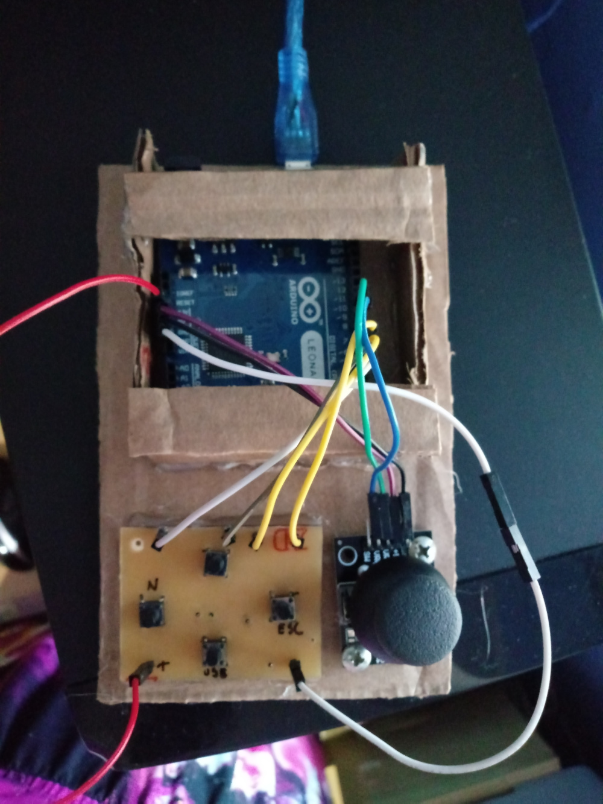

# Simple Joystick com Arduino

Projeto de um Joystick simplificado para arduino Leonardo utilizando um módulo de joystick e quatro botões, finalizado com uma case-protótiopo de papelão.
Para uma otimização de projeto, os quatro botões avulsos foram organizados em uma PCB caseira feita com fenolite e percloreto de ferro, permitindo uma melhor manipulação dos fios necessários para o funcionamento do projeto.

## Como funciona:

O projeto utiliza a biblioteca Keyboard disponível para arduino Leonardo para fazer com que as ações realizadas nos sensores fossem interpretadas como comandos de teclado. O módulo de Joystick possui o mapeamento para as setas direcionais, enquanto os quatro botões avulsos que compõem a segunda parte do projeto foram mapeados para teclas selecionadas de acordo com o jogo **[Super Tux Kart](https://supertuxkart.net/Main_Page)**, utilizado como base para o desenvolvimento por sua simplicidade.

## Como usar:

O projeto pode ser adaptado para jogos simples, de acordo com a necessidade do usuário. Para utilizar o projeto em outros jogos é preciso alterar a configuração dos botões avulsos, dentro do código, alterando os comandos realidados quando um destes botões é apertado.

## Componentes:

- Arduino Leonardo (IMPORTANTE: O projeto deve ser realizado com o Arduino Leonardo ou o Arduino Leonardo Pro-Micro pois o micro processador da placa precisa ser compatível com a biblioteca Keyboard.h);
- Módulo de Joystick;
- Jumpers macho-fêmea;
- 4 push-buttons (utilizados na PCB);
- 4 resistores de 1k ohms (para atuarem como pull-downs na PCB).

## Biblioteca Usada:

- Keyboard.h (se encontra na pasta lib do repositorio).
